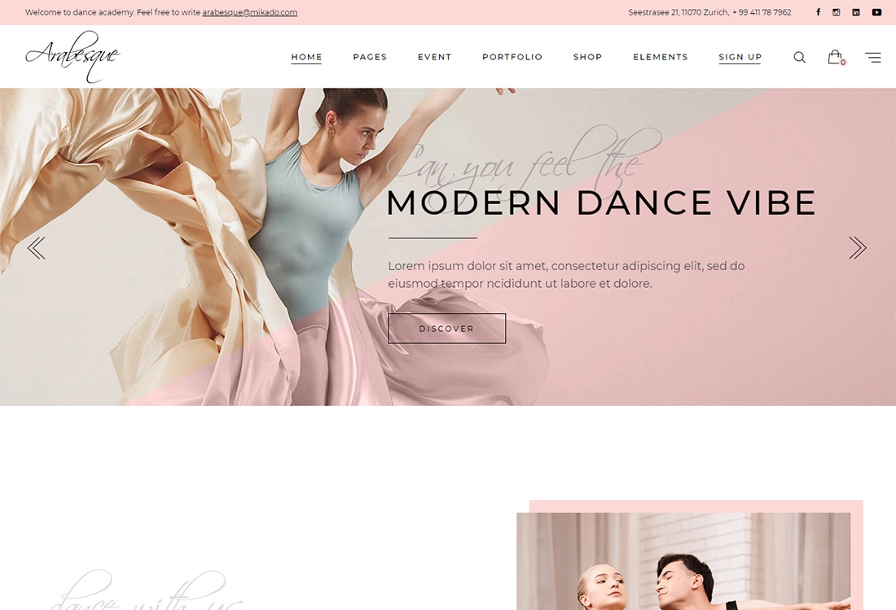
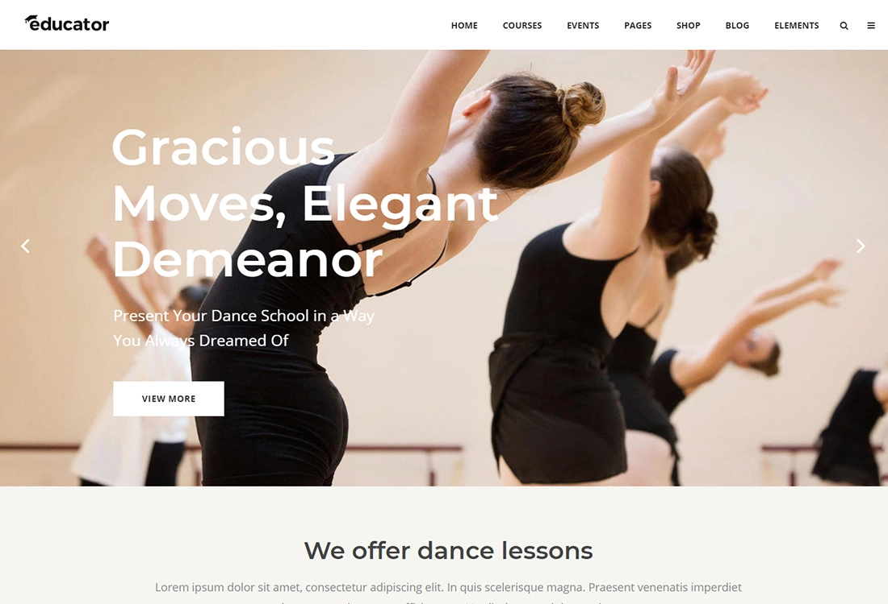
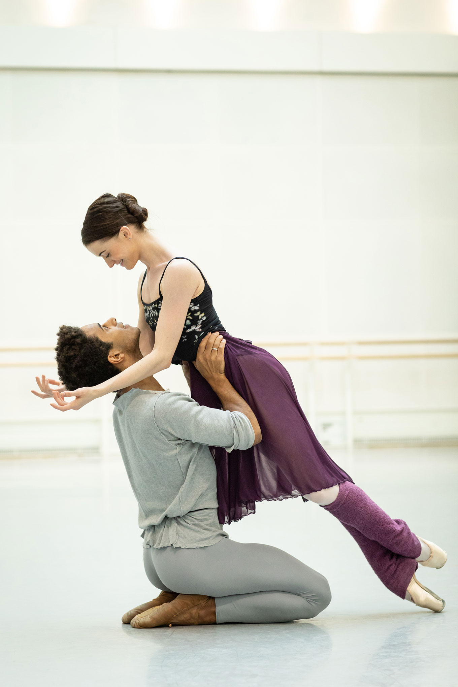
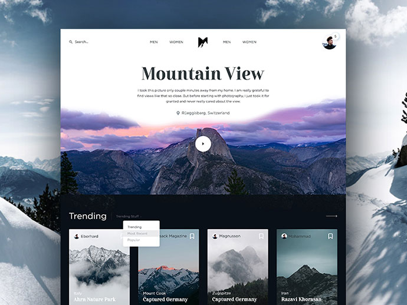
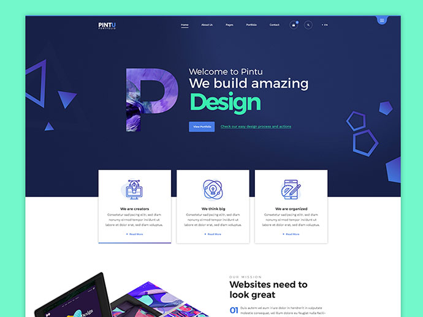

# DANCE HEALTH ALLIANCE REDESIGN
For this project, I redesigned the website for the charity Dance Health Alliance. In this page, I have inlcuded resources surrounding my ideation and proposal process, and in the [source](/source/) folder, I have inclded the HTML and CSS page designs I created.

# Chosen Charity

[The Dance Health Alliance Current Website](https://www.dancehealthalliance.org.au/)

# Recorded Presentation

[Digital Advertising Approach - Video Presentation by ejessurun](https://www.canva.com/design/DAEs3Np1rHk/RuAmhJvNIHN7suKpDXlclg/view?utm_content=DAEs3Np1rHk&utm_campaign=designshare&utm_medium=link&utm_source=recording_view)

# Slides

[Proposal slides](https://www.canva.com/design/DAEs3Np1rHk/RuAmhJvNIHN7suKpDXlclg/view?utm_content=DAEs3Np1rHk&utm_campaign=designshare&utm_medium=link&utm_source=publishsharelink)

# Sketches

[Porposal Sketches](https://drive.google.com/file/d/1k-WnZlZ4B0FYBsm44aYv69s0cmB0T6tL/view?usp=sharing)

# Wireframes

[Proposal Wireframes](https://www.figma.com/file/IWfLGsKC5IHqn6wpXnCchv/DHA-WireFrames?node-id=0%3A1)

# Mockups

[Proposal Mockups](https://www.figma.com/file/PbaTJgSEnRZHP0XvMZJGtG/DHA-Mockups?node-id=1%3A2)

# Links/Resources Mentioned In Slides

Slide 11

Colour scheme - ("Create a palette - Coolors", 2021)

Slide 14

Screenshot of contrast checker - ("Colour Contrast Checker", 2021)

Slide 15

[User Profiles](https://www.notion.so/User-Profiles-f9744b856f704f13b962511a66b07f31?pvs=21)

Slide 22-23

Information Architecture SiteMaps - [https://miro.com/app/board/o9J_ltED4C0=/](https://miro.com/app/board/o9J_ltED4C0=/)

Slide 25

Dance Mood Board - (Silkalns, 2021)

Arabesque & Educator from [https://colorlib.com/wp/wordpress-themes-for-dance-studios/](https://colorlib.com/wp/wordpress-themes-for-dance-studios/)

[https://cocosteaparty.com/royal-ballet-romeo-juliet.html](https://cocosteaparty.com/royal-ballet-romeo-juliet.html)

Slide 27

Home Page Ideas - (Mehtab, 2018)

Slide 29 

Ready Set Dance - [https://readyset.dance/](https://readyset.dance/)

("READY SET DANCE", n.d.)

Slide 31

OzHarvest - [https://events.ozharvest.org/donate-to-ozharvest?utm_source=website&utm_medium=navigation&utm_campaign=2021](https://events.ozharvest.org/donate-to-ozharvest?utm_source=website&utm_medium=navigation&utm_campaign=2021)

("Donate to OzHarvest", n.d.)

# References

Colour Contrast Checker. (2021). Retrieved from https://colourcontrast.cc/ffffff/ee7669

Create a palette - Coolors. (2021). Retrieved from https://coolors.co/ecf7f6-f2f2f2-f7caca-ee7669-0066a6-333333

Donate to OzHarvest. Retrieved from https://events.ozharvest.org/donate-to-ozharvest?utm_source=website&utm_medium=navigation&utm_campaign=2021

Mehtab, M. (2018). 60+ Awesome Website Header design ideas for Inspiration. Retrieved from https://www.isharearena.com/ui-design/60-awesome-website-header-design-ideas/

PACIFIC NORTHWEST BALLET. (2015). Brittany Reid [Image]. Retrieved from https://blogpnborg.wordpress.com/2015/04/01/pnb-says-farewell-to-brittany-reid/

READY SET DANCE. Retrieved from https://readyset.dance/

Silkalns, A. (2021). 18 Best WordPress Themes For Dance Studios 2021. Retrieved from https://colorlib.com/wp/wordpress-themes-for-dance-studios/

The HARID Conservatory. [Image]. Retrieved from http://harid.edu/student-outreach-performances/

THE ROYAL BALLET’S NEW ROMEO & JULIET SHARE THEIR SECRETS TO ON-STAGE CHEMISTRY. (2021). [Image]. Retrieved from https://cocosteaparty.com/royal-ballet-romeo-juliet.html